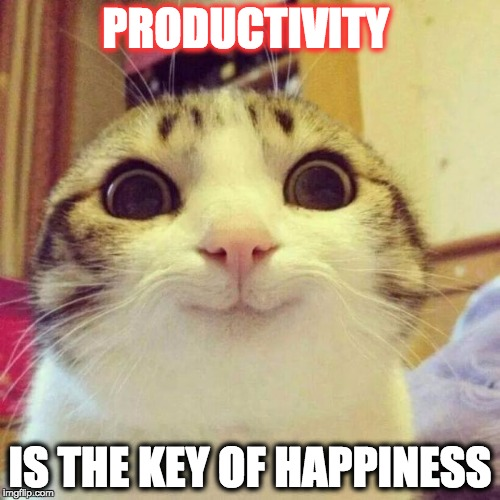
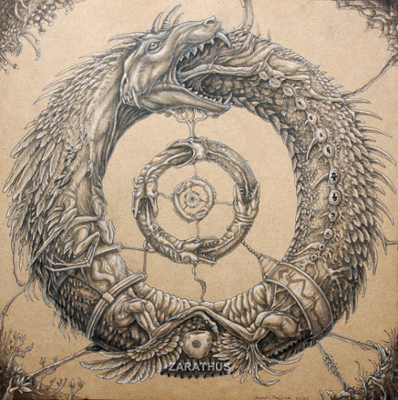
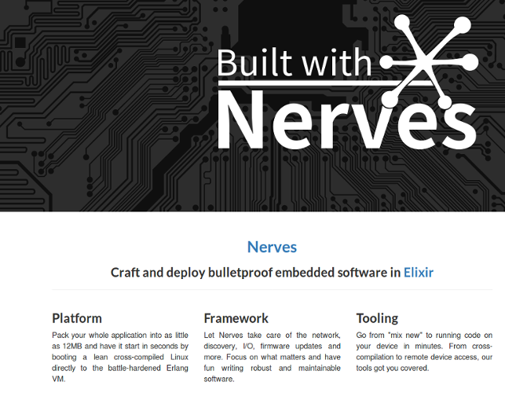

#HSLIDE

## Защо Elixir?


#HSLIDE


#HSLIDE
### Кой съм аз?

* Аз съм Николай/Meddle. <!-- .element: class="fragment" -->
* Аз съм баща. <!-- .element: class="fragment" -->
* Програмирам сървъри, а понякога и клиенти  <!-- .element: class="fragment" -->
* Работя във ВИК-то <!-- .element: class="fragment" -->
* Част съм от elixir-lang.bg <!-- .element: class="fragment" -->

#HSLIDE


#HSLIDE
### DISCLAIMER


#HSLIDE
### Кои сте вие?

* Хора с различни интереси в софтуера, а може би и в хардуера? <!-- .element: class="fragment" -->
* Фенове на Elixir/Erlang? <!-- .element: class="fragment" -->
* Интересно ви е какво сега е HYPE!!?11! <!-- .element: class="fragment" -->
* Честно казано по това време не очаквам да сте много :) <!-- .element: class="fragment" -->

#HSLIDE


#HSLIDE
### По същество!

 <!-- .element: class="fragment" -->

#HSLIDE
### Защо да уча нов език?!

* Нали си знам PHP | JAVA | C# | Ruby | Python | Това-с-което-си-вадя-хляба? <!-- .element: class="fragment" -->
* Тези хипстъри, дето всяка година учат нов език, за нищо не стават!  <!-- .element: class="fragment" -->
* Ееее, всяка година, не, всяка седмица, нова глупост, то не може всичко я! <!-- .element: class="fragment" -->
* Тоя ще ми обяснява : 'Ето вижте колко яко пиша, почвайте да пишете и вие!'. <!-- .element: class="fragment" -->

#HSLIDE


#HSLIDE
### Защо Elixir?

* Всички твърдения от предния слайд са вярни. Не всичко работи за всички. <!-- .element: class="fragment" -->
* Аз няма да ви уча на Elixir, ако имате интерес, има курс. <!-- .element: class="fragment" -->
* Искам да ви покажа нещата, които го правят различен от всички други технологии в момента. <!-- .element: class="fragment" -->
* Няма сребърен куршум, но за всичко си има набор от добри инструмени. <!-- .element: class="fragment" -->

#HSLIDE


#HSLIDE
### Какво е Elixir?

* Elixir е език, който върви на BEAM. <!-- .element: class="fragment" -->
* BEAM e виртуалната машина на Erlang.  <!-- .element: class="fragment" -->
* Ахаа! Значи нещо като Scala както се отнася към Java?  <!-- .element: class="fragment" -->
* И да и не.  <!-- .element: class="fragment" -->
* Elixir е Erlang. Но и нещо повече. <!-- .element: class="fragment" -->

#HSLIDE
### Какво е Erlang?


#HSLIDE
### Имало едно време ...

* ... в средата на 80-те в лаборатория на Ericsson <!-- .element: class="fragment" -->
* ... един човек със задача <!-- .element: class="fragment" -->
* ... да създаде способ за писане на конкурентни програми, които да могат да се изпълняват безкрайно. <!-- .element: class="fragment" -->
* По-добър начин за писане на Телеком програми. <!-- .element: class="fragment" -->

#HSLIDE
### Телеком програми


#HSLIDE
### Телеком програми
* Конкурентни (едно устройство трябва да може да поддържа хиляди едновременни транзакции).
* Толерантни към грешки и проблеми, както софтуерни, така и хардуерни.  <!-- .element: class="fragment" -->
* Практически нулев downtime.  <!-- .element: class="fragment" -->
* Кодът им да може да се заменя с по-нови версии, докато те работят.  <!-- .element: class="fragment" -->

#HSLIDE
#### А какви проблеми имаме днес?
 <!-- .element: class="fragment" -->

#HSLIDE


#HSLIDE


#HSLIDE


#HSLIDE
#### Сериозно, да продължим напред: Разказвахме приказка!


#HSLIDE
### Имало едно време ...

* Човекът, Joe Armstrong, създал конкурентен диалект на Prolog. <!-- .element: class="fragment" -->
* Появил се втори човек, Рobert Virding, и двамата създали език за писане на телеком програми, написан на Prolog. <!-- .element: class="fragment" -->
* Накрая Mike Williams пренаписал всичко на C. <!-- .element: class="fragment" -->
* Следват още пренаписвания и се появяват BEAM и OTP. <!-- .element: class="fragment" -->
* С времето езикът става отворен. <!-- .element: class="fragment" -->
* Да, това е Erlang. <!-- .element: class="fragment" -->

#HSLIDE


#HSLIDE
### Erlang!
1. Кодът върви в процеси, които са на ниво език.
2. Тези процеси не споделят памет - имат собствен стек и собствен heap. <!-- .element: class="fragment" -->
3. Много са евтини за създаване и си комуникират чрез размяна на съобщения.  <!-- .element: class="fragment" -->
4. Лесно могат да си комуникират помежду си, дори да са на различни машини. <!-- .element: class="fragment" -->
5. Ако един процес 'умре', другите продължават да живеят. Може нов да го замести, зависи от стратегията. <!-- .element: class="fragment" -->

#HSLIDE
### Erlang!


#HSLIDE
Joe Armstrong нарича Erlang език за конкурентно-ориентирано програмиране, като се базира на няколко правила:

#HSLIDE
* Системата е изградена от процеси.
* Процесите не споделят нищо.  <!-- .element: class="fragment" -->
* Процесите си комуникират чрез асинхронно изпращане на съобщения.  <!-- .element: class="fragment" -->
* Процесите са изолирани един от друг.  <!-- .element: class="fragment" -->

#HSLIDE


#HSLIDE
### Erlang върви на BEAM

* BEAM е способна да използва всички ядра на процесора без проблем. <!-- .element: class="fragment" -->
* BEAM-level процесите са много малки 1KB-2KB при създаването си. <!-- .element: class="fragment" -->
* Можем да създаваме огромен брой процеси без да се притесняваме. Говорим за милиони.  <!-- .element: class="fragment" -->
* Scheduler-ите на BEAM използват стратегия, различна от стратегиите в други езици - превантивна стратегия.  <!-- .element: class="fragment" -->

#HSLIDE
### Preemptive Strategy


#HSLIDE
### Why Erlang?


#HSLIDE
### Erlang и OTP

* Erlang и OTP са едно и също, версиите на Erlang са версии на OTP.
* OTP идва и с множество полезни библиотеки.
* Система за наблюдение и реагиране на грешка!
* Let it CRASH!!!

#HSLIDE
### Let it CRASH!!!


#HSLIDE
### Why Erlang?


#HSLIDE
### Добре? A Elixir??

* Elixir наследява всички тези специфики и идеологии. Все пак върви на BEAM. <!-- .element: class="fragment" -->
* Elixir може да използва всичко писано на Erlang. <!-- .element: class="fragment" -->
* Elixir идва с много добър tooling. <!-- .element: class="fragment" -->
* Elixir има много добро и бързо-растящо общество. <!-- .element: class="fragment" -->
* Elixir е модерен език, добър за web, IOT, даже embedded разработка. <!-- .element: class="fragment" -->
* Споменах ли, че е функционален език? <!-- .element: class="fragment" -->

#HSLIDE


#HSLIDE
### Началото

* Езикът се ползва някъде от 2013 (2011 първи копки) година, което го прави доста млад. <!-- .element: class="fragment" -->
* Създателят на Elixir, Жозе Валим (José Valim) идва от ruby/rails света. <!-- .element: class="fragment" -->
* Бързо набира популярност сред рубистите и ерлангаджиите. <!-- .element: class="fragment" -->

#HSLIDE


#HSLIDE
### Защо Elixir?
* Защото можем да си напишем сървис, който ще поддържа хиляди потребителя online и ще живее в един OS процес.
* Защото имаме качествен tooling! <!-- .element: class="fragment" -->

#HSLIDE
### Tooling

* Elixir идва с mix. <!-- .element: class="fragment" -->
* Mix изпънява различни задачи - да речем прави нов Elixir проект. <!-- .element: class="fragment" -->
* Много лесно е да си напишем и своя задачка. <!-- .element: class="fragment" -->

#HSLIDE
### MIX


#HSLIDE
### Tooling

* Всъщност с mix можем да си направим собствена библиотека. <!-- .element: class="fragment" -->
* И да я качим в hex, откъдето можем да сваляме библиотеки на други хора. <!-- .element: class="fragment" -->
* Под hex, имам предви - hex.pm . <!-- .element: class="fragment" -->
* Също така mix се справя страхотно с dependencies. <!-- .element: class="fragment" -->

#HSLIDE
### NOT MIX


#HSLIDE
### Tooling

* Получаваме и ex_doc, за който има mix task - 'mix doc'. <!-- .element: class="fragment" -->
* Генерира лесна за навигиране и ползване документация с връзки към source code-a. <!-- .element: class="fragment" -->
* Както и вградена testing библиотека ExUnit . <!-- .element: class="fragment" -->
* Лесна и приятна за ползване. <!-- .element: class="fragment" -->

#HSLIDE
### ExDoc


#HSLIDE
### Tooling
* Ще си кажете - добре това всеки модерен език го има!
* Да, но не винаги вградено и не винаги качествено! <!-- .element: class="fragment" -->
* Напоследък сме свикнали да ни е лесно... <!-- .element: class="fragment" -->
* А make, ant, npm, maven и какво ли още не?? <!-- .element: class="fragment" -->

#HSLIDE
### Life is easier these days for everybody!


#HSLIDE
### Защо Elixir?
* Защото можем да си напишем сървис, който ще поддържа хиляди потребителя online и ще живее в един OS процес.
* Защото имаме качествен tooling!
* Защото езикът е доста приятен и лесен за продуктивна работа!! <!-- .element: class="fragment" -->

#HSLIDE
### Продуктивност



#HSLIDE
### Синтаксис

```elixir
defmodule MyModule do
  import OtherModule

  def public_function(x) do
    x * private_function(x)
  end

  defp private_function(x) do
    x + other_module_public_function(x)
  end
end
```

#HSLIDE
### Синтаксис


#HSLIDE
### Езикът Elixir

* Модули, които са колекции от функции.
* Всичко е immutable.
* Кодът е изграден от композирани от функции.
* Всичко върви в BEAM-процес.
* Кодът в тези BEAM-процеси е последователен, процесите вървят конкурентно един на друг.

#HSLIDE
### Синтаксис

```elixir
File.stream!("path/to/some/file")
|> Stream.flat_map(&String.split(&1, " "))
|> Enum.reduce(%{}, fn word, acc ->
  Map.update(acc, word, 1, & &1 + 1)
end)
|> Enum.to_list()
```

#HSLIDE
### Pipes


#HSLIDE
### Процеси:
Процесите в Elixir/Erlang се създават със `spawn`.

```elixir
# Тази функция ще се изпълни в нов процес:
pid = spawn fn -> 2 * 21 end

Process.alive?(pid)
# false, тъй като функцията се изпълнява бързо.

# Можем да ползваме pid-а на текущия процес с:
self()
Process.alive?(self()) # true
```

#HSLIDE
### Процеси:

```elixir
pid = spawn(fn ->
  receive do
    {:howdy, message} -> IO.puts(message)
    {_, message} -> IO.puts("Няма значение")
  end
end)

send pid, {:howdy, "Как си?"}
```

#HSLIDE
Друго си е shared state, threads and locks!


#HSLIDE
### Защо Elixir?
* Защото можем да си напишем сървис, който ще поддържа хиляди потребителя online и ще живее в един OS процес.
* Защото имаме качествен tooling!
* Защото езикът е доста приятен и лесен за продуктивна работа!!
* Защото с Elixir сме МЕТА! <!-- .element: class="fragment" -->

#HSLIDE
### Metaprogramming


#HSLIDE
### Metaprogramming

* Всъщност defmodule е макро.
* Както и def за функция.
* Както и почти всичко, което ще ползвате.

#HSLIDE
### Elixir е написан на Elixir


#HSLIDE
### Защо Elixir?
* Защото можем да си напишем сървис, който ще поддържа хиляди потребителя online и ще живее в един OS процес.
* Защото имаме качествен tooling!
* Защото езикът е доста приятен и лесен за продуктивна работа!!
* Защото с Elixir сме МЕТА!
* Защото обществото около Elixir ще ви приветства! <!-- .element: class="fragment" -->

#HSLIDE
### Имаме моментум


#HSLIDE
### Обществото
* Има все повече и повече meetup-и!
* Две големи конференции и множество по-малки!
* И в България - Elixir Sofia Meetup, Partial Conf, elixir-lang.bg !
* Форумът, слакът, майлинг листите, блогове!
* Начин да си намираме работа и да си помагаме.

#HSLIDE
### Обществото
* Elixir обществото раздвижи Erlang обществото.
* Erlang се развива, Elixir програмисти правят PR-и, помагат.
* Ще имаме по-добър tooling -> formatter, property testing.
* Ще имаме повече предложения за работа!
* Имаме и ще имаме множество чудесни библиотеки.

#HSLIDE
### Имаме моментум



#HSLIDE
### Защо Elixir?
* Защото можем да си напишем сървис, който ще поддържа хиляди потребителя online и ще живее в един OS процес.
* Защото имаме качествен tooling!
* Защото езикът е доста приятен и лесен за продуктивна работа!!
* Защото с Elixir сме МЕТА!
* Защото обществото около Elixir ще ви приветства!
* И всички тези mixture-и! <!-- .element: class="fragment" -->

#HSLIDE
### Plug & Phoenix


#HSLIDE
### Phoenix!!


#HSLIDE
### Nerves



#HSLIDE
### Ecto


#HSLIDE
### И още и още


#HSLIDE
### Има и още неща за които си говорим!


#HSLIDE
## Защо Elixir?
* А защо не? Какво губите? <!-- .element: class="fragment" -->

#HSLIDE
### Откъде да започнем?

* https://elixir-lang.org
* https://elixirforum.com
* https://elixir-slackin.herokuapp.com
* https://elixirschool.com

#HSLIDE
### Откъде да започнем?

* https://elixir-lang.bg
* https://www.meetup.com/Elixir-Sofia
* https://www.facebook.com/groups/ElixirSofia
* https://elixirschool.com/bg
* http://partialconf.com

#HSLIDE
### Meetup


#HSLIDE
## Край

* https://twitter.com/ntzvetinov
* http://themeddle.com


